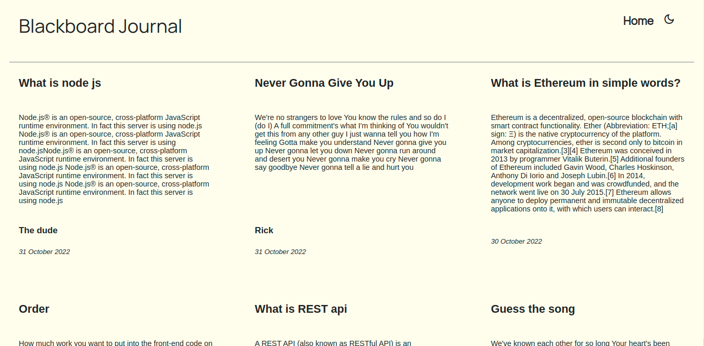
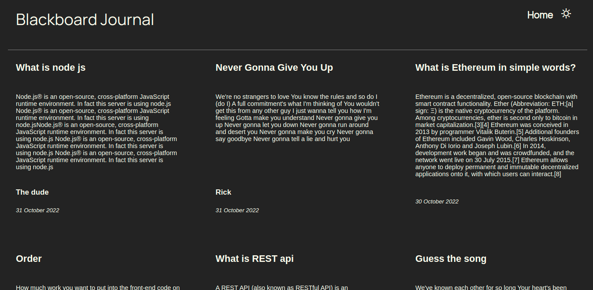

# blog-client
Blog-Client we named Blackboard Journal. Is a simple blogging application.
To display the blog that build for client and with the CMS and API on different repository.

Currently the blog is contain for text only and we can perform CRUD on
[blog-cms](https://cmsblackboardjournal-oy5v6p5c9-kurniadikevin.vercel.app/) with login-require.


 Back end server for Blog-Client and Blog-Cms for MERN stack blog-app project.
Develop using:

-MongoDb

-Express.js

-React.js

-Node.js

To run the repository locally we are using npm with command

```npm run start```

**Blog-Client**

[blog-client](https://blackboardjournal-927wbbdjo-kurniadikevin.vercel.app/) Deployment

[blog-client](https://github.com/kurniadikevin/blog-client) Repository

**Blog-API**

[blog-api](https://blog-api-production-8114.up.railway.app/) Deployment

[blog-api](https://github.com/kurniadikevin/blog-api) Repository

**Blog-CMS**

[blog-cms](https://cmsblackboardjournal-oy5v6p5c9-kurniadikevin.vercel.app/) Deployment

[blog-cms](https://github.com/kurniadikevin/blog-cms) Repository




